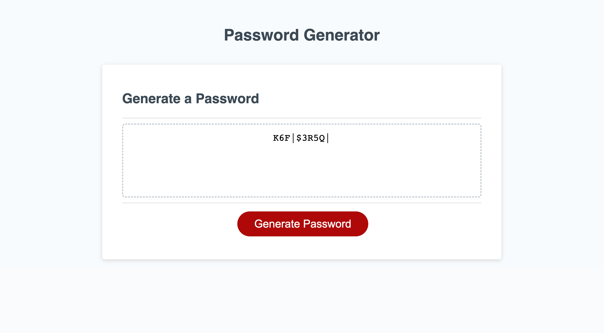

# JavaScript: Password Generator

## Description

Here is a working random PassWordGenerator, I had to code the JavaScript in order to make it work "properly"

## Task

This week's Challenge requires you to modify starter code to create an application that enables employees to generate random passwords based on criteria that they’ve selected. This app will run in the browser and will feature dynamically updated HTML and CSS powered by JavaScript code that you write. It will have a clean and polished, responsive user interface that adapts to multiple screen sizes.

## What I Learned

- the power of Functions are, at the least Powerful
- breaking a project down into small managable pieces will relief stress tremendously
- thinking in a logically way via computer language can be challenging, but it is doable 
- taking a break from a difficult problem will help you come back fresh with a solution (most times)

## RoadMap
 - I feel it is pretty effecient as of now, but as I grow and learn. My plan is to update my portfolio challenges.
 - CSS could be more "Jazzed Up" 

